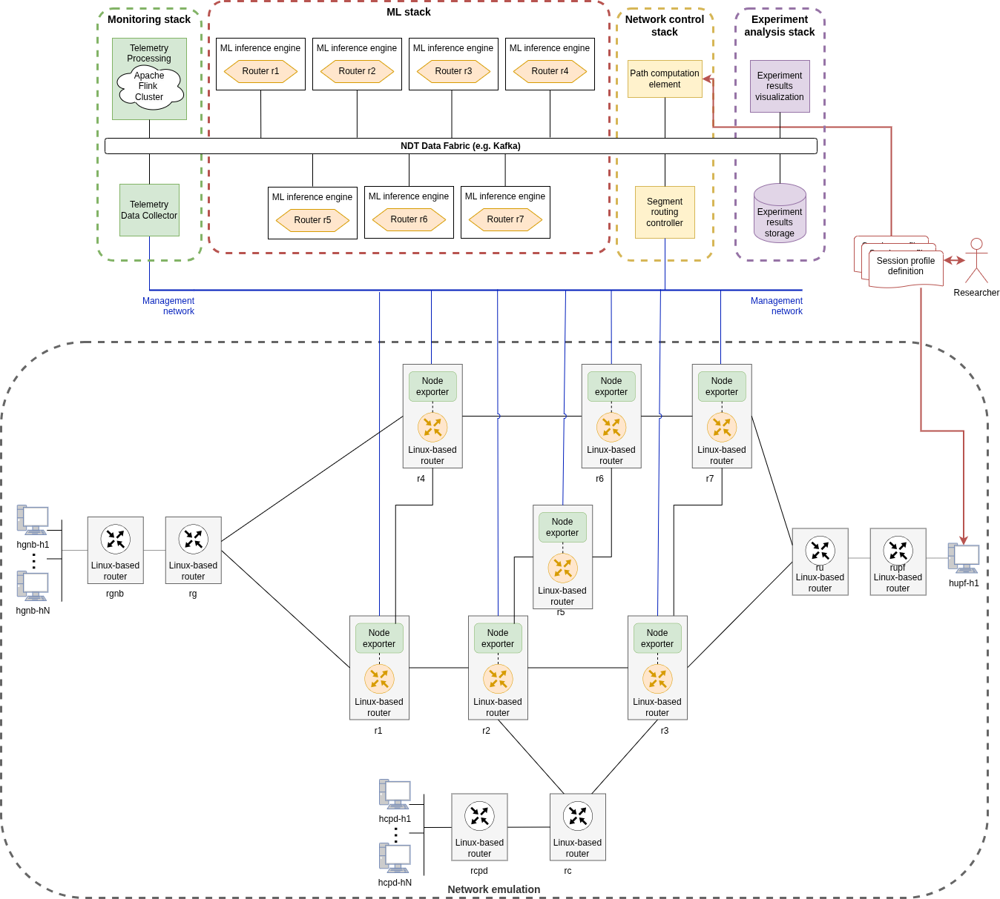

# vnx-srv6

Scenarios for studying and analyzing SRv6 (Segment Routing over IPv6 dataplane).

## Table of Contents

- [Deploying b5g](#deploying-b5g)
    - [1. Launch the Scenario](#1-launch-the-scenario)
        - [Step 1.1: Convert Containerlab Topology to Clabernetes Format](#step-11-convert-containerlab-topology-to-clabernetes-format)
        - [Step 1.2: Deploy the Converted Topology](#step-12-deploy-the-converted-topology)
    - [2. Launch the Controller](#2-launch-the-controller)
    - [Using the Controller](#using-the-controller)
    - [Iperf Example](#iperf-example)
- [Delete Experiment](#delete-experiment)
- [Repository Structure](#repository-structure)
- [Requirements](#requirements)

## Deploying b5g



### 1. Launch the Scenario

First, choose the topology you want to launch and navigate to its corresponding directory.  
If the `converted` folder already exists, skip to step 1.2.

#### Step 1.1: Convert Containerlab Topology to Clabernetes Format

Use the modified `clabverter` with the following alias:

```bash
alias clabverter='sudo docker run --user $(id -u) \
        -v $(pwd):/clabernetes/work --rm \
        ghcr.io/giros-dit/clabernetes/clabverter'
```

Convert the topology:

```bash
clabverter --naming non-prefixed --outputDirectory ./converted --destinationNamespace across-tc32
```

#### Step 1.2: Deploy the Converted Topology

Once the topology is converted, deploy it with:

```bash
kubectl apply -f ./converted
```

Then, apply the deployment patch:

```bash
./converted/deployment-patcher.sh
```

After successful deployment, for each `rg` node, add the default route for the upstream link with the following command.  
**Note:** Replace `fcff:5::1` with the appropriate loopback address of the `ru` node for your specific scenario:

```bash
kubectl exec deploy/rg1 -- docker exec rg1 ip -6 route add fd00:0:1::/127 encap seg6 mode encap segs <ru-loopback-ip> dev eth1
```

For example, if the `ru` loopback address is `fcff:5::1`:

```bash
kubectl exec deploy/rg1 -- docker exec rg1 ip -6 route add fd00:0:1::/127 encap seg6 mode encap segs fcff:5::1 dev eth1
```

### 2. Launch the Controller

Once the network, monitoring stack, and analysis stack are running, launch the controller using the script in `NetworkControlStack/k8s`:

```bash
./deploy.sh
```

This script will create the necessary ConfigMap and start the controller.

### Using the Controller

To create a flow, run the following command (replace the destination IP with the appropriate one):

```bash
kubectl exec deploy/networkstack -- python3 flows.py fd00:0:2::3/64
```

Alternatively, access the controller pod interactively:

```bash
kubectl exec -it deploy/networkstack -- bash
```

Then run:

```bash
python3 flows.py fd00:0:2::3/64
```

### Iperf Example

Example of iperf3 between systems hupf-h1 and hgnb1-h1

#### hupf-h1

```bash
iperf3 -c fd00:0:2::2 -V -u -b 20M -l 1000 -t 300
```

#### hgnb1-h1

```bash
iperf3 -s -V -B fd00:0:2::2
```

## Repository Structure

```
.
├── NetworkControlStack/
│   └── k8s/
├── converted/
├── topologies/
├── scripts/
├── README.md
└── ...
```

- **NetworkControlStack/**: Controller and related Kubernetes manifests/scripts.
- **converted/**: Output directory for converted topologies.
- **topologies/**: Source Containerlab topology files.
- **scripts/**: Utility scripts for deployment and management.

## Requirements

- Docker
- Kubernetes (kubectl)
- Containerlab
- Python 3.x
