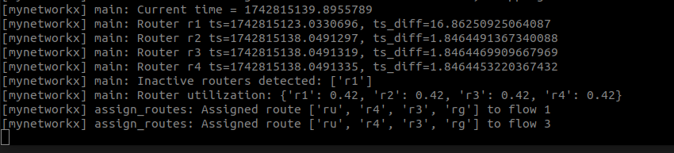

# Test algoritmo

## Intro
Para llevar a cabo estas pruebas se han empleado unos archivos JSON que simulan el estado de la red. Además, se incluye el estado del json de los flujos, para comprobar los resultados.

## Tabla de Experimentos

| Prueba      | Número de flujos existentes | Número de flujos añadidos | Incremento de la utilización del router por flujo | Routers activos     |
|-------------|-----------------------------|---------------------------|---------------------------------------------------|---------------------|
| Prueba 1    | 0                           | 1                         | 21%                                               | [r1, r2, r3, r4]    |
| Prueba 2    | 1                           | 1                         | 21%                                               | [r1, r2, r3, r4]    |
| Prueba 3    | 3                           | 1                         | 21%                                               | [r1, r2, r3, r4]    |
| Prueba 4    | .                           | .                         | .                                                 | .                   |
| Prueba 5    | .                           | .                         | .                                                 | .                   |
| Prueba 6    | .                           | .                         | .                                                 | .                   |
| Prueba 7    |                             | 1                         | 21%                                               | [r2, r3, r4]        |

## Prueba 1 Primer flujo

Fichero json: networkxalgorithm/tests/flows_uso21r1r2.json

Como ya se observó anteriormente, el algoritmo siempre asigna primero el camino r2 → r1 antes que el camino r4 → r3 cuando ambos tienen el mismo coste. Se ha modificado el orden en el que se añaden los nodos al grafo, pero el comportamiento continúa siendo el mismo.

```json
{
    "flows": [
        {
            "_id": "1",
            "version": 1,
            "route": [
                "ru",
                "r2",
                "r1",
                "rg"
            ]
        }
    ],
    "inactive_routers": [],
    "router_utilization": {
        "r1": 0.00,
        "r2": 0.00,
        "r3": 0.00,
        "r4": 0.00
    }
}
```

## Prueba 2 Segundo flujo

Fichero json: networkxalgorithm/tests/flows_uso21r1r2.json

Con un único flujo, se incrementa la utilización de los routers r1 y r2 para verificar que el algoritmo selecciona la ruta r4 → r3, tal como se muestra en el siguiente JSON.

```json

{
    "flows": [
        {
            "_id": "1",
            "version": 1,
            "route": [
                "ru",
                "r2",
                "r1",
                "rg"
            ]
        },
        {
            "_id": "2",
            "version": 1,
            "route": [
                "ru",
                "r4",
                "r3",
                "rg"
            ]
        }
    ],
    "inactive_routers": [],
    "router_utilization": {
        "r1": 0.21,
        "r2": 0.21,
        "r3": 0.00,
        "r4": 0.00
    }
}

```

## Prueba 3 Antes del sorpaso del primer umbral

Se comprueba que funciona correctamente la asignación de rutas cuando solo 1 camino sobrepasa el umbral del 80%, es decir como los routers r1 y r2 sobrepasan el umbral, pero r3 y r4 no, por tanto el nuevo flujo con identificador 8, se le encamina por los routers r3 y r4.

```json

{
    "flows": [
        {
            "_id": "1",
            "version": 1,
            "route": [
                "ru",
                "r2",
                "r1",
                "rg"
            ]
        },
        {
            "_id": "2",
            "version": 1,
            "route": [
                "ru",
                "r4",
                "r3",
                "rg"
            ]
        },
        {
            "_id": "3",
            "version": 1,
            "route": [
                "ru",
                "r2",
                "r1",
                "rg"
            ]
        },
        {
            "_id": "4",
            "version": 1,
            "route": [
                "ru",
                "r4",
                "r3",
                "rg"
            ]
        },
        {
            "_id": "5",
            "version": 1,
            "route": [
                "ru",
                "r2",
                "r1",
                "rg"
            ]
        },
        {
            "_id": "6",
            "version": 1,
            "route": [
                "ru",
                "r4",
                "r3",
                "rg"
            ]
        },
        {
            "_id": "7",
            "version": 1,
            "route": [
                "ru",
                "r2",
                "r1",
                "rg"
            ]
        },
        {
            "_id": "8",
            "version": 1,
            "route": [
                "ru",
                "r4",
                "r3",
                "rg"
            ]
        }
    ],
    "inactive_routers": [],
    "router_utilization": {
        "r1": 0.84,
        "r2": 0.84,
        "r3": 0.63,
        "r4": 0.63
    }
}

```

## Prueba 4 Sorpaso primer umbral

Se ha probado a crear un flujo cuando se supera el 80% de capacidad. Se envia el siguiente aviso. Se añade el flow4 que al tener todos al 84% se envia por la ruta r2→r1

```json

{
    "flows": [
        {
            "_id": "1",
            "version": 1,
            "route": [
                "ru",
                "r2",
                "r1",
                "rg"
            ]
        },
        {
            "_id": "2",
            "version": 1,
            "route": [
                "ru",
                "r4",
                "r3",
                "rg"
            ]
        },
        {
            "_id": "3",
            "version": 1,
            "route": [
                "ru",
                "r2",
                "r1",
                "rg"
            ]
        },
        {
            "_id": "4",
            "version": 1,
            "route": [
                "ru",
                "r4",
                "r3",
                "rg"
            ]
        },
        {
            "_id": "5",
            "version": 1,
            "route": [
                "ru",
                "r2",
                "r1",
                "rg"
            ]
        },
        {
            "_id": "6",
            "version": 1,
            "route": [
                "ru",
                "r4",
                "r3",
                "rg"
            ]
        },
        {
            "_id": "7",
            "version": 1,
            "route": [
                "ru",
                "r2",
                "r1",
                "rg"
            ]
        },
        {
            "_id": "8",
            "version": 1,
            "route": [
                "ru",
                "r4",
                "r3",
                "rg"
            ]
        },
        {
            "_id": "9",
            "version": 1,
            "route": [
                "ru",
                "r2",
                "r1",
                "rg"
            ]
        }
    ],
    "inactive_routers": [],
    "router_utilization": {
        "r1": 0.84,
        "r2": 0.84,
        "r3": 0.84,
        "r4": 0.84
    }
}

```

## Prueba 4 No sorpaso segundo umbral

Como no se supera el umbral del 95% con los routers r3 y r4,  se le asigna ruta utilizando a estos.

```json

{
    "flows": [
        {
            "_id": "1",
            "version": 1,
            "route": [
                "ru",
                "r2",
                "r1",
                "rg"
            ]
        },
        {
            "_id": "2",
            "version": 1,
            "route": [
                "ru",
                "r4",
                "r3",
                "rg"
            ]
        },
        {
            "_id": "3",
            "version": 1,
            "route": [
                "ru",
                "r2",
                "r1",
                "rg"
            ]
        },
        {
            "_id": "4",
            "version": 1,
            "route": [
                "ru",
                "r4",
                "r3",
                "rg"
            ]
        },
        {
            "_id": "5",
            "version": 1,
            "route": [
                "ru",
                "r2",
                "r1",
                "rg"
            ]
        },
        {
            "_id": "6",
            "version": 1,
            "route": [
                "ru",
                "r2",
                "r1",
                "rg"
            ]
        },
        {
            "_id": "7",
            "version": 1,
            "route": [
                "ru",
                "r2",
                "r1",
                "rg"
            ]
        },
        {
            "_id": "8",
            "version": 1,
            "route": [
                "ru",
                "r4",
                "r3",
                "rg"
            ]
        },
        {
            "_id": "9",
            "version": 1,
            "route": [
                "ru",
                "r2",
                "r1",
                "rg"
            ]
        },
        {
            "_id": "10",
            "version": 1,
            "route": [
                "ru",
                "r4",
                "r3",
                "rg"
            ]
        }
    ],
    "inactive_routers": [],
    "router_utilization": {
        "r1": 1.0,
        "r2": 1.0,
        "r3": 0.84,
        "r4": 0.84
    }
}

```

## Prueba 5 Sorpaso del segundo umbral


Como todos routers están al 100% de capacidad, al flujo 11 no se le asigna una ruta.

```json

{
    "flows": [
        {
            "_id": "1",
            "version": 1,
            "route": [
                "ru",
                "r2",
                "r1",
                "rg"
            ]
        },
        {
            "_id": "2",
            "version": 1,
            "route": [
                "ru",
                "r4",
                "r3",
                "rg"
            ]
        },
        {
            "_id": "3",
            "version": 1,
            "route": [
                "ru",
                "r2",
                "r1",
                "rg"
            ]
        },
        {
            "_id": "4",
            "version": 1,
            "route": [
                "ru",
                "r4",
                "r3",
                "rg"
            ]
        },
        {
            "_id": "5",
            "version": 1,
            "route": [
                "ru",
                "r2",
                "r1",
                "rg"
            ]
        },
        {
            "_id": "6",
            "version": 1,
            "route": [
                "ru",
                "r2",
                "r1",
                "rg"
            ]
        },
        {
            "_id": "7",
            "version": 1,
            "route": [
                "ru",
                "r2",
                "r1",
                "rg"
            ]
        },
        {
            "_id": "8",
            "version": 1,
            "route": [
                "ru",
                "r4",
                "r3",
                "rg"
            ]
        },
        {
            "_id": "9",
            "version": 1,
            "route": [
                "ru",
                "r2",
                "r1",
                "rg"
            ]
        },
        {
            "_id": "10",
            "version": 1,
            "route": [
                "ru",
                "r4",
                "r3",
                "rg"
            ]
        },
        {
            "_id": "11",
            "version": 1
        }
    ],
    "inactive_routers": [],
    "router_utilization": {
        "r1": 1.0,
        "r2": 1.0,
        "r3": 1.0,
        "r4": 1.0
    }
}

```

## Prueba 6 Caida de router

Partiendo de la prueba anterior, se pausa el router r1, entonces las rutas que contienen ese router son modificadas como vemos en el siguiente json. Partiendo de este estado:

```json
{
    "flows": [
        {
            "_id": "1",
            "version": 1,
            "route": [
                "ru",
                "r2",
                "r1",
                "rg"
            ]
        },
        {
            "_id": "2",
            "version": 1,
            "route": [
                "ru",
                "r4",
                "r3",
                "rg"
            ]
        },
        {
            "_id": "3",
            "version": 1,
            "route": [
                "ru",
                "r2",
                "r1",
                "rg"
            ]
        },
        {
            "_id": "4",
            "version": 1,
            "route": [
                "ru",
                "r4",
                "r3",
                "rg"
            ]
        }
    ],
    "inactive_routers": [],
    "router_utilization": {
        "r1": 0.42,
        "r2": 0.42,
        "r3": 0.21,
        "r4": 0.21
    }
}

```

Tras la caida del router r1, el nuevo estado de la red es el siguiente:



```json

{
    "flows": [
        {
            "_id": "1",
            "version": 2,
            "route": [
                "ru",
                "r4",
                "r3",
                "rg"
            ]
        },
        {
            "_id": "2",
            "version": 1,
            "route": [
                "ru",
                "r4",
                "r3",
                "rg"
            ]
        },
        {
            "_id": "3",
            "version": 2,
            "route": [
                "ru",
                "r4",
                "r3",
                "rg"
            ]
        },
        {
            "_id": "4",
            "version": 1,
            "route": [
                "ru",
                "r4",
                "r3",
                "rg"
            ]
        }
    ],
    "inactive_routers": [
        "r1"
    ],
    "router_utilization": {
        "r1": 0.42,
        "r2": 0.42,
        "r3": 0.42,
        "r4": 0.42
    }
}

```

## Prueba 7 añadir flujo con router caido

Con 2 flujos por los routers r3 y r4, se añade un 3 flujo y se comprueba que al estar caido r1, le asignan el camino de r4→r3

```json

{
    "flows": [
        {
            "_id": "1",
            "version": 2,
            "route": [
                "ru",
                "r4",
                "r3",
                "rg"
            ]
        },
        {
            "_id": "2",
            "version": 1,
            "route": [
                "ru",
                "r4",
                "r3",
                "rg"
            ]
        },
        {
            "_id": "3",
            "version": 1,
            "route": [
                "ru",
                "r4",
                "r3",
                "rg"
            ]
        }
    ],
    "inactive_routers": [
        "r1"
    ],
    "router_utilization": {
        "r1": 0.0,
        "r2": 0.0,
        "r3": 0.42,
        "r4": 0.42
    }
}


```
